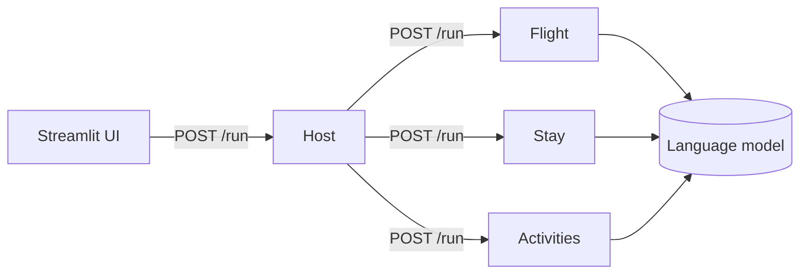

## One request, four agents

A trip plan has three independent parts: getting there, staying there, and things to do. Each part is handled by its own agent, a small web service with one job. A fourth agent, the Host, is the only one clients talk to.

When a request arrives, the Host sends the same trip details to Flight, Stay, and Activities **at the same time** and waits for all three. Each specialist builds a prompt, asks the language model for suggestions in a fixed JSON shape, checks the answer, and returns it. The Host puts the three answers into one trip plan.

The Host itself never calls the model. It only coordinates.

## Partial answers instead of failures

If one agent fails or takes too long, the Host doesn't fail the whole request. It returns what the other agents produced, plus an entry in `errors` saying which part is missing and why. A trip plan with flights and activities but no hotels is more useful than an error page, and the UI shows the missing part as a warning.

Failures are contained at two levels:

- **In the agent:** if the model call fails, times out, or returns JSON that doesn't match the expected shape, the agent returns a response with an `error` field instead of crashing, for example "Stay planner is temporarily unavailable."
- **In the Host:** if an agent can't be reached or doesn't answer within `DOWNSTREAM_TIMEOUT_SECONDS`, the Host records "Service is temporarily unavailable."

The two messages tell you which side failed; see [Fix "temporarily unavailable" results](/how-to/fix-timeouts).

## Why separate services

Running each agent as its own process costs some complexity: four processes instead of one, and network calls between them. In return:

- **They run in parallel.** The slowest part of a plan is waiting for the model. Three agents waiting at once take about as long as the slowest one, not the sum of all three.
- **They deploy independently.** In the cloud setup, Flight ran on Railway while the other three ran on AWS. Nothing in the code had to know that; the Host just calls three URLs.
- **They fail independently.** A crash in one agent doesn't take down the others.

## One image, four agents

All four agents share one codebase and one Docker image. The `APP_MODULE` environment variable tells the image which agent to start, for example `agents.stay_agent.__main__`. This keeps the build simple: CI builds once, and the same image goes to every service.

Shared pieces live in `common/` and `shared/`: the web app factory (health checks, the optional API key, request logging), the language-model clients, the request and response models, and settings. Every agent exposes the same endpoints; see [HTTP API](/reference/http-api).

## The shared contract

Every service validates requests and responses against the same Pydantic models in `shared/schemas.py`. A trip request is checked at the Host (dates in order, budget above zero, and so on), and again by each agent when it arrives. Responses are checked at every step: the agent checks what the model returned, and the Host checks what the agent returned. A malformed answer is caught where it happens, instead of surfacing as a confusing error in the UI.

## Curated guidance

Before asking the model, Flight, Stay, and Activities add relevant curated guidance to the prompt, with its source, and tell the model not to invent sources. This is a small retrieval step, described in [Language models and structured output](/explanation/llm-providers#curated-guidance).

## About the name

The project is called "ADK-Powered" after an earlier design built on Google's Agent Development Kit. The current agents are plain FastAPI services that call each other over HTTP; the ADK code was removed because nothing used it. Each agent still publishes a small description at `.well-known/agent.json`, a convention from agent-to-agent protocols.
