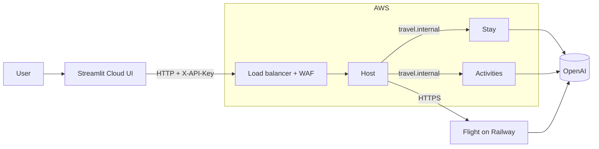

The cloud deployment put the planner on the internet: the Host, Stay, and Activities agents on AWS, the Flight agent on Railway, the UI on Streamlit Community Cloud, and OpenAI as the language model. It's now dormant because, even after every cost reduction, it cost more than a coursework project could justify. This page explains the design and the numbers.

## Layout

- **Only the Host is public**, through an Application Load Balancer. Stay and Activities have private names in AWS Cloud Map (`stay.travel.internal`, `activities.travel.internal`) that only the Host can reach.
- **Flight stayed on Railway** because it was deployed there first. The Host reaches it at its Railway HTTPS URL, just like any other agent.
- Everything is defined in two Terraform modules; see [Terraform modules](/reference/terraform).

## Keeping costs down

Each of these choices removed a cost:

**No NAT gateway.** Tasks in private subnets need a NAT gateway (about $35 per month) to reach the internet, which they must do to pull images and call OpenAI. Instead, tasks run in public subnets with their own public IP addresses, and security groups block all inbound traffic to them. Only the load balancer accepts connections from the internet.

**Fargate Spot.** Tasks run on spare AWS capacity, about 70% cheaper than regular Fargate. AWS can reclaim a Spot task with two minutes' notice, and ECS starts a replacement. Acceptable for a demo, not for a production service.

**A daily schedule.** Services run from 08:00 to 22:00 Manila time and scale to zero overnight. Stopped tasks also give up their public IP addresses, which AWS bills by the hour.

**Spinning down.** Some costs can't be scheduled away: the load balancer and WAF bill every hour they exist, and neither can be paused. So the ECS module is designed to be destroyed completely between uses and recreated in about 10 minutes. Everything that takes effort to recreate (network, permissions, container images, secrets) lives in the separate foundation module, which costs almost nothing and is never destroyed.

**Push-based metrics.** Grafana Cloud's free tier receives metrics directly from the agents, with no always-on collector to pay for. See [Observability](/explanation/observability).

## What it cost

Approximate monthly AWS cost while the stack runs, in `us-east-1`:

| Item | Per month | Notes |
| --- | --- | --- |
| Load balancer | about $16.40 | Every hour it exists |
| Load balancer public IPs (2) | about $7.30 | Every hour it exists; AWS requires two availability zones |
| WAF | about $8 | Every hour it exists |
| Fargate Spot, 3 tasks | about $9 | 14 hours a day |
| Task public IPs (3) | about $6.30 | 14 hours a day |
| Cloud Map, logs, ECR | about $1 | |
| **Total** | **about $50** | about $32 of it fixed, whether or not anyone uses it |

Spun down, the foundation costs a few cents a month for stored images.

OpenAI was the cheapest part. Measured on the live stack, Stay and Activities together used about 800 prompt and 300 completion tokens per trip plan, about $0.0003 at `gpt-4o-mini` prices. With Flight, a whole plan costs about $0.001.

Railway's Flight service ran on a trial plan; after the trial it needs a paid plan.

## Why it's dormant

The fixed $32 per month buys a public URL that stays reachable, which only matters when someone is using it. For a project demonstrated occasionally, that's mostly money spent on idle infrastructure, and spinning up for each demo takes about 15 minutes of setup. The self-hosted setup does everything the cloud one does, for free.

So the cloud deployment is kept, not deleted: all its code and infrastructure definitions stay in the repository, the foundation stays in AWS, and it can be brought back with [Reactivate the cloud deployment](/how-to/reactivate-the-cloud).
